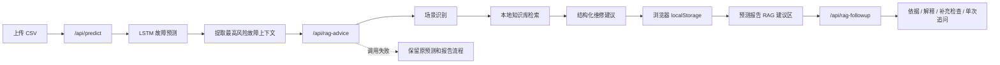

# 航空发动机健康监测系统 RAG 模块开发汇报

> 汇报日期：2026-08-11
> 项目：华为云大赛航空发动机健康监测演示系统
> 本次范围：在不改变原故障预测算法和原接口返回结构的前提下，新增独立 RAG 维修建议模块并接入预测报告

## 一、工作目标

原系统已经具备以下主流程：

```text
上传飞行 CSV 数据 -> LSTM 推理 -> 故障段聚合 -> 部件风险分析 -> 看板和预测报告
```

本次工作的目标是在原流程之后增加“有依据的维修处置建议”，形成：

```text
故障预测 -> 故障上下文整理 -> 本地知识检索 -> 结构化处置建议 -> 报告展示
```

实施时遵守三个边界：

1. 不修改原 LSTM 预测算法。
2. 不修改 `/api/predict` 的既有响应结构。
3. RAG 失败时不阻断原预测和报告流程。

## 二、最终实现概览

本次新增了一个独立的 `backend/rag/` 模块，完成以下能力：

1. 维护本地可追溯知识库。
2. 将 Markdown 知识文档切分为检索片段。
3. 根据部件、故障类型、风险等级和异常特征检索相关依据。
4. 输出固定结构的维修辅助建议。
5. 通过独立 FastAPI 接口对前端提供能力。
6. 在预测成功后自动请求 RAG，并在预测报告中展示结果。
7. 增加六个最小回归测试，覆盖首批典型场景和第二阶段安全边界。
8. 完成第二阶段半开放助手，支持查看依据、建议解释、补充检查项和单次维修追问。

当前版本是“本地关键词检索 + 固定结构生成”的可审计 MVP，不依赖外部大模型、Embedding 服务或向量数据库。这样可以先验证业务闭环，同时避免比赛演示受网络、密钥和模型响应波动影响。

## 三、系统流程



## 四、后端开发内容

### 4.1 独立目录

所有 RAG 核心逻辑都保存在 `backend/rag/`：

| 文件 | 作用 |
|---|---|
| `rag/__init__.py` | 模块出口 |
| `rag/build_index.py` | 扫描 Markdown、切分文档并生成可选 JSON 索引 |
| `rag/retriever.py` | 本地关键词检索和 Top-K 排序 |
| `rag/agent.py` | 场景识别、风险归一化和结构化建议生成 |
| `rag/test_rag.py` | RAG 回归测试 |
| `rag/README.md` | 模块接口和运行说明 |
| `rag/knowledge_base/` | 本地维修和安全知识库 |

### 4.2 首批知识库

当前知识库包含四篇可追溯文档：

| 分类 | 文档 | 覆盖场景 |
|---|---|---|
| 发动机维修 | `engine_over_temperature.md` | EGT/排气温度超限 |
| 发动机维修 | `engine_vibration.md` | 发动机振动异常 |
| 机场处置 | `hydraulic_leak.md` | 液压系统泄漏 |
| 安全边界 | `safety_notice.md` | 适航、放行和人工复核边界 |

每条检索结果都会返回 `source`，前端能够展示建议依据，而不是只显示无法追溯的结论。

### 4.3 场景识别

第一版支持三个重点场景：

1. 发动机排气温度超限。
2. 发动机振动异常。
3. 液压系统泄漏风险。

输入缺少明确 `fault_type` 时，模块会结合部件名称和异常特征进行保守映射；仍无法判断时回退为“发动机综合异常”，输出通用复核建议。

### 4.4 新增 API

接口：

```http
POST /api/rag-advice
Content-Type: application/json
```

请求示例：

```json
{
  "component": "动力涡轮",
  "fault_type": "发动机振动异常",
  "risk_level": "高",
  "confidence": 0.86,
  "abnormal_features": [
    "Engine_Vibration_X_Axis",
    "Engine_Vibration_Z_Axis"
  ],
  "description": "发动机振动值持续升高"
}
```

响应固定包含：

1. `abnormal_judgment`：异常判断。
2. `risk_level`：归一化风险等级。
3. `recommended_actions`：建议检查步骤。
4. `release_recommendation`：放行建议。
5. `references`：检索依据和来源。
6. `precautions`：安全注意事项。

高风险场景会输出“不建议直接放行，应由有资质维修人员复核”的保守结论。系统明确声明 RAG 不能代替适航放行结论。

第二阶段新增：

```http
POST /api/rag-followup
Content-Type: application/json
```

该接口接受一期建议作为 `context`，支持四种 `action`：

1. `evidence`：查看当前建议依据。
2. `why`：解释为什么生成当前建议。
3. `extra_checks`：给出补充检查项。
4. `question`：回答一次性维修相关追问。

对于当前知识库未覆盖的问题，接口返回 `supported=false` 并明确说明依据不足，不生成开放域答案。

## 五、前端开发内容

### 5.1 预测完成后自动调用 RAG

`HomeView.vue` 在 `/api/predict` 成功后，从最高风险故障中提取：

- 部件名称；
- 故障类型或故障描述；
- 风险等级；
- 预测概率；
- 异常特征。

随后异步调用 `/api/rag-advice`。该调用使用 `void requestRagAdvice(...)`，不会阻塞原看板完成状态；发生异常时只记录警告，不改变原预测结果。

成功结果保存到浏览器 `localStorage.ragAdvice`，新一轮上传前会清除旧结果，避免不同架次之间串用建议。

### 5.2 预测报告新增展示区

`PredictReport.vue` 新增“AI 维修处置建议”区域，展示：

1. 异常判断。
2. 风险等级。
3. 是否建议放行。
4. 建议检查步骤。
5. 参考依据及知识来源。
6. 注意事项。

该区域使用 `v-if="ragAdvice"`：只有成功获取 RAG 结果时才显示，没有结果时保持原报告布局，不显示空白模块。

前端没有新增独立聊天页面或开放问答入口，符合第一版“报告内自动建议”的范围。

### 5.3 第二阶段半开放助手

预测报告的 RAG 区域新增：

1. “查看依据/隐藏依据”切换。
2. “为什么这样建议”快捷操作。
3. “补充检查项”快捷操作。
4. 单次维修问题输入和提交。
5. 依据不足状态提示。

追问失败不会清除一期建议或影响报告其它区域；当前不保存对话历史，也不执行多轮上下文推理。

## 六、兼容性与隔离设计

为了尽量保证原功能不受影响，本次采用以下措施：

1. RAG 后端逻辑全部放在独立目录。
2. 原 `/api/predict` 接口没有改名，也没有改变返回字段。
3. RAG 使用新的 `/api/rag-advice` 接口，与模型推理解耦。
4. 前端 RAG 请求独立捕获异常。
5. RAG 结果只写入独立的 `localStorage` 键。
6. 报告通过条件渲染接入，不替换原维护建议和风险清单。

## 七、验证结果

### 7.1 RAG 单元测试

执行：

```powershell
cd backend
python -B -m unittest rag.test_rag -v
```

结果：6 个测试全部通过，覆盖：

1. EGT 超温知识命中及高风险放行边界。
2. 缺少 `fault_type` 时的部件回退识别。
3. 液压泄漏知识命中。
4. 第二阶段三个快捷动作保留引用依据。
5. 放行问题输出保守结论。
6. 开放域未知问题明确拒答。

### 7.2 RAG HTTP 验证

实际调用 `/api/rag-advice`：

- HTTP 调用成功；
- `status=success`；
- 返回 3 条检查步骤；
- 返回 4 条带来源的检索证据；
- 振动场景命中 `knowledge_base/engine_manual/engine_vibration.md`。
- `/api/rag-followup` 的依据、解释和补充检查动作均返回成功并保留 4 条引用。
- 放行追问被识别为支持的问题，天气问题返回 `supported=false`。

### 7.3 原预测接口回归

使用项目现有 `data.csv` 重新调用 `/api/predict`：

| 检查项 | 实测结果 |
|---|---:|
| 接口状态 | `success` |
| 原始故障段 | 1090 |
| 报告故障明细 | 53 |
| 部件排行项 | 5 |
| 全局指标 | 8 |

结果与交接基线一致，说明新增 RAG 导入和路由没有破坏原预测接口。

### 7.4 前端构建

使用 Vite 生产构建验证：

```powershell
npm.cmd exec vite build
```

结果：600 个模块转换完成，构建成功。

项目原 `npm run build` 会先执行 `vue-tsc`，但仓库当前缺少 `tsconfig.json`，因此该命令仍会在 TypeScript 配置阶段退出。这是项目原有构建配置缺口，本次没有为完成 RAG 而扩大范围修改它。

### 7.5 当前运行状态

核对时服务监听状态：

- 前端：`http://127.0.0.1:5173/`
- 后端：`http://127.0.0.1:8000/`
- 接口文档：`http://127.0.0.1:8000/docs`

## 八、现场演示步骤

1. 启动后端和前端。
2. 打开前端首页。
3. 上传项目根目录的 `data.csv`。
4. 等待 LSTM 预测完成，观察原风险看板仍正常更新。
5. 点击“预测报告”。
6. 查看“AI 维修处置建议”区域。
7. 展示异常判断、检查步骤、放行建议和参考依据。
8. 点击“为什么这样建议”和“补充检查项”。
9. 分别追问“现在能否继续放行”和一个无关问题，演示保守回答与依据不足拒答。
10. 在接口文档中单独调用两个 RAG 接口，演示知识命中和第二阶段响应。

## 九、本次未包含的内容

以下能力不在当前 MVP 中，汇报时不应描述为已完成：

1. 没有接入真实大模型 API。
2. 没有接入 Embedding 模型或 FAISS/Chroma 向量数据库。
3. 没有实现会话历史、多轮追问和开放域聊天；第二阶段只支持单次、受约束的维修追问。
4. 知识库仍是演示级短文档，不是完整、最新的厂家手册和适航文件。
5. 原预测结果仍缺少稳定的 `fault_type` 和真实异常特征语义，当前通过部件和关键词回退识别。
6. 用户截图中“部件数据”区域的窄宽度文字重叠问题尚未修复，不属于已完成成果。

## 十、后续建议

建议按照以下顺序继续：

1. 修复“部件数据”区域的响应式重叠，完成前端展示收口。
2. 让 `/api/predict` 输出真实 `fault_type`、真实传感器名称和异常偏离幅度。
3. 将当前关键词检索替换为本地或云端 Embedding + 向量索引，并保留关键词回退。
4. 接入可配置的大模型生成层，同时保留固定 JSON 输出和安全约束。
5. 扩充并版本化真实维修手册、机场处置流程和法规知识。
6. 增加检索准确率测试集，评估 Top-K 命中率、引用正确性和安全边界。
7. 在有限追问稳定后，再评估是否需要引入持久化会话和多轮上下文。

## 十一、汇报总结

本次工作完成了一个与现有预测系统解耦的 RAG 维修建议 MVP，使系统从“只给出故障风险”扩展为“给出故障风险、建议动作和可追溯依据”。

当前实现的核心价值是闭环完整、演示稳定、来源可追溯、失败可回退；同时对能力边界保持诚实：它是本地检索增强的结构化建议模块，而不是已经完成的通用大模型维修专家。
